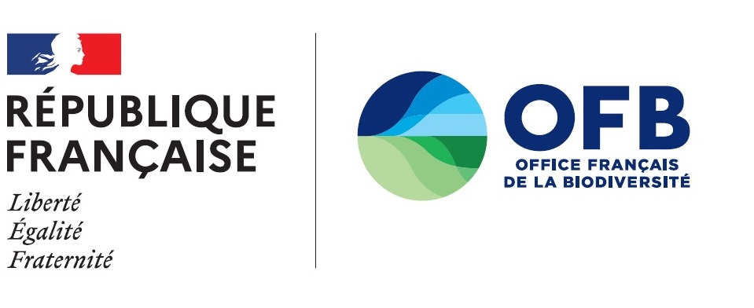

Pour toutes questions relatives à l’utilisation de l’outil et l’interprétation des résultats, contactez :  

**Sarah BAUDUIN**  
Chargée de Recherche Grands Carnivores  
Direction de la Recherche et Appui Scientifique  
Service Conservation et Gestion des Espèces à Enjeux  
**Office Français de la Biodiversité**   
147, avenue de Lodève, 34990 JUVIGNAC  
Mél : sarah.bauduin@ofb.gouv.fr  
{width="35%"}  

----------    
```{r, echo = FALSE, layout="l-body-outset"}
knitr::include_graphics("images/piedPage.jpg")
```
