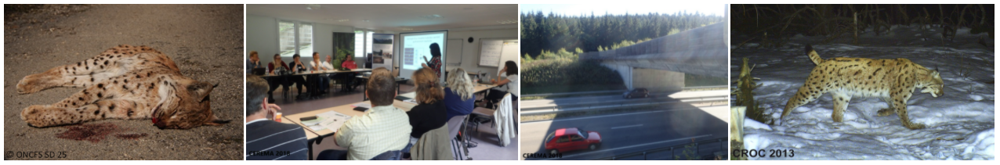

```{r, echo = FALSE, layout="l-body-outset"}

```

# Éviter, réduire et compenser le risque de mortalité du lynx par collision avec les véhicules de transport


### But du projet

Le projet ERC-Lynx a permis de mettre en commun, compléter et exploiter les résultats de précédents travaux en lien avec la viabilité des populations de lynx boréal *(Lynx lynx)* observées en France, en Allemagne et en Suisse, les risques de collision lors du franchissement d'infrastructures de transports terrestres et les mesures correctrices.

En effet, les projets d’aménagement (qu’ils soient routiers ou bâtis) sont autant susceptibles d’impacter, à plus ou moins long terme, la viabilité de ces populations de lynx puisqu’ils peuvent modifier la quantité, la répartition et la connectivité des habitats favorables au lynx ainsi que le risque de mortalité pour cette espèce au travers des collisions avec les véhicules de transport. Or, actuellement, les services en charge de réaliser l’évaluation environnementale et d’appliquer la séquence ERC pour un projet d’aménagement où le lynx est potentiellement présent, s’appuient uniquement sur une analyse à dire d’expert à l’échelle locale.

Dans ce contexte, le projet ERC-Lynx a abouti à la création de l’outil ERC-Lynx qui permet d’évaluer l’effet de tels projets d’aménagements à l’horizon de 50 ans sur les populations de lynx observées en France. Dans le but de favoriser le maintien ou de renforcer la connectivité écologique fonctionnelle entre les habitats favorables du lynx, cet outil permet de comparer les effets positifs de mesures d’évitement (ex : recherche d’un nouveau tracé), de réduction (ex : création d’un éco-pont) ou de compensation (ex : conversion de terres exploitées en habitats forestiers). Le déploiement de cet outil constitue une aide à la décision dans le choix, la localisation et l’entretien de mesures correctrices prioritaires sur lesquelles orienter les efforts d’aménagement et de financement.

### L’outil en bref

Cet outil combine données, savoirs locaux et résultats d’analyses tels que :

* Des données sur les cas de collisions routières de lynx avec un modèle statistique expliquant leurs déterminants tels que des caractéristiques propres aux infrastructures de transport et permettant de prédire les zones potentielles à fort risque de collision pour le lynx.
* Des données sur la présence du lynx en Europe de l’Ouest avec un modèle statistique expliquant les caractéristiques du paysage favorisant la présence de cette espèce et permettant de prédire les différents types d’habitats du lynx dans l’espace.
* Un modèle de type « individu-centré spatialement explicite » simulant les populations de lynx sur 50 ans par des données d’écologie comportementale et de dynamique des populations sur le lynx et permettant d’extraire des indices renseignant la viabilité des populations.
* Une interface interactive pour permettre aux utilisateurs non-spécialistes d'utiliser facilement l’outil.  

### Équipe projet
* Olivier Gimenez, Aurélie Coulon - [CEFE](https://www.cefe.cnrs.fr/fr/){target="_blank"}-[CNRS](https://www.cnrs.fr/fr/page-daccueil){target="_blank"}
* Estelle Germain, Anaïs Charbonnel, Charlotte-Anaïs Olivier - CROC
* Alain Morand, Emilie Buisson, Delphine Souillot, Luc Chrétien - [Cerema](https://www.cerema.fr/fr){target="_blank"}
* Sarah Bauduin, Christophe Duchamp, Nolwenn Drouet-Hoguet - [OFB](https://www.ofb.gouv.fr/){target="_blank"}

### Acteurs associés
CD39, PNR Haut-Jura, FDC 39, Eiffage, APRR, CD Doubs, SFEPM, Louvetier 88, LPO FC / FNE 25 / Syndicat Mixte Loue, Pôle Grand Prédateur, UMR Théma Franche Comté, DDT 25, 39, 54 & 90, Centre Athénas, DREAL BFC & GE, CGDD, PNA Lynx SFEPM, Région Bourgogne Franche-Comté, VNF – DT Nord-Est, ONF, DGITM.  

Ce projet de recherche appliquée à portée opérationnelle a rassemblé un ensemble diversifié d’acteurs (publics et privés, chercheurs, gestionnaires d’espaces naturels et spécialistes des carnivores, gestionnaires d’infrastructures et spécialistes en charge de l’ingénierie des routes et de la planification des transports, etc.) autour d’une espèce protégée, le lynx, et d’une problématique à enjeu de conservation élevé, l’aménagement du territoire.  

----------
```{r, echo = FALSE, layout="l-body-outset"}
knitr::include_graphics("images/piedPage.jpg")
```
