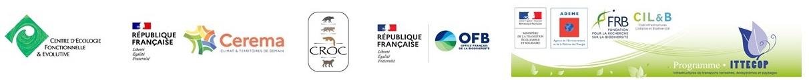

**22-23 octobre 2019.** Sarah Bauduin a présenté une partie des résultats du projet aux journées <a href="https://jiem-nantes-19.sciencesconf.org/" target="blank">Journées Ifremer - Réseau Mexico - GDR Ecostat - GDR MascotNum</a>.  

**24 septembre 2019.** Le troisième et dernier atelier a eu lieu à Besançon. Nous avons présenté l'interface et les acteurs ont pu la prendre en main. Nous avons également discuté collectivement des améliorations à apporter à l'interface. Prochain rendez-vous au second trimestre 2020 pour la journée de restitution des résultats du projet.  

**2 juillet 2019.** Alain Morand a présenté une partie des résultats du projet à la journée d’échanges techniques <a href="http://www.trameverteetbleue.fr/vie-tvb/agenda/journee-echanges-techniques-continuites-ecologiques-collisions-avec-faune-donnees-aux" target="blank">« Continuités écologiques et collisions avec la faune : des données aux solutions »</a> organisée par l'AFB.  

**20 juin 2019.** Delphine a soutenu son stage de Master 2 avec succès à l'Université de Perpignan Via Domitia. Son stage « Réduire et éviter le risque de mortalité du Lynx boréal (Lynx lynx) par collision avec les véhicules de transports terrestres dans le Massif du Jura - Typologie des tronçons accidentogènes et profils biologiques des lynx morts » ouvre de nouvelles perspectives d'applications du projet. Bravo et merci Delphine !  

**16-19 juin 2019.** Estelle Germain et Nolwenn Drouet-Hoguet ont présenté le projet à l'Expert conference on the Eurasian lynx in West and Central Europe" organisée par le « Rhineland Palatinate region » et le « Cat Specialist Group » de l'IUCN.  

**5-6-7 juin 2019.** Alain Morand et Olivier Gimenez ont présenté le projet au <a href="https://ittecop.fr/fr/?option=com_content&view=article&id=470:a-vos-agenda-colloque-ittecop-2019-les-5-6-et-7-juin-2019-a-l-ademe-sophia-antipolis&catid=70:agenda-thematique" target="blank">colloque 2019 ITTECOP</a> organisé à Sophia Antipolis. La présentation du projet est <a href="files/contenuSiteGoogle/201906_ERC-Lynx_ ITTECOP_Colloque_diaporama.pdf" target="blank">ici</a>.  

**30 janvier 2019.** Nous accueillons Delphine Souillot dans le cadre d’un stage de Master 2 d'une durée de 6 mois. Le sujet du stage consistera à approfondir un ou plusieurs cas concrets de collision en vue de proposer, avec les services compétents des infrastructures et ouvrages concernés, les mesures correctrices les plus adaptées. Le stage sera hébergé au CEREMA.  

**16 janvier 2019.** Parution d'un article sur la page web du CEREMA intitulé <a href="https://www.cerema.fr/fr/actualites/outil-destine-aux-territoires-reduire-accidentologie-du-lynx" target="blank">« Un outil destiné aux territoires pour réduire l'accidentologie du Lynx »</a> résumant le projet.  

**Octobre 2018.** Sarah Bauduin a présenté une partie des résultats du projet à <a href="https://sfecologie2018.sciencesconf.org/" target="blank">la conférence de la Société Française d’Écologie et d’Évolution à Rennes</a>.  

**27 septembre 2018.** Le deuxième atelier a eu lieu à Besançon. Nous avons présenté les améliorations apportées aux modèles de collisions et d'habitat, ainsi qu'une première version de l'interface. Nous avons également discuté collectivement des scénarios d'aménagement et comment les implémenter via l'interface. Prochain rendez-vous en mars 2019 pour le troisième atelier.  

**11-14 septembre 2018.** Sarah, Alain et Luc ont participé à <a href="https://www.iene.info/international-conferences/iene-2018/" target="blank">la conférence IENE 2018</a> qui s'est tenue au Pays-Bays. Sarah y a présenté les travaux effectués dans le cadre de notre projet « A user-friendly computer platform to assess the impact of transport infrastructure on wildlife: a case study with the Eurasian lynx in France ».  

**6 septembre 2018.** Charlotte-Anaïs a soutenu son stage de Master 2 devant son comité d’examen de l’EPHE à Paris. Son stage « Étude comparative de différentes méthodes de modélisation de corridors écologiques pour le Lynx boréal en France » ouvre sur de nouvelles perspectives de recherche qui nous l’espérons pourront être étudiées à l’avenir. Bravo et merci Charlotte-Anaïs !  

**5 juin 2018.** Le premier atelier a eu lieu à Besançon. Nous avons présenté le modèle de viabilité, explicité et discuté collectivement des hypothèses sur lesquelles repose ce modèle. Nous avons défini avec les acteurs le format de l’interface selon leurs attentes, leurs besoins, leurs contraintes, etc. en espérant pouvoir fournir un outil opérationnel. Les présentations sont disponibles <a href="files/contenuSiteGoogle/Interface.pdf" target="blank">ici</a>, <a href="files/contenuSiteGoogle/intro_atelier1.pdf" target="blank">ici</a> et <a href="files/contenuSiteGoogle/ModelIBM.pdf" target="blank">là</a>. Prochain rendez-vous, le 27 septembre pour le deuxième atelier.  

**25 avril 2018.** Parution d'un article présentant le projet dans la lettre d'information du Centre de Ressources Trame Verte et Bleue à lire <a href="http://www.trameverteetbleue.fr/vie-tvb/lettre-information/38#zoom" target="blank">ici</a>.  

**5 mars 2018.** Nous avons organisé à Besançon la réunion de lancement du projet en présence des acteurs du territoire. Il s'agissait d'informer sur le projet et d'un appel à partenariat pour les ateliers à venir. <a href="files/contenuSiteGoogle/ERClynx_introductionv4_web.pdf" target="blank">Plus de détails dans la présentation d'introduction</a>.  

**1 février 2018.** Nous accueillons Charlotte-Anaïs Olivier dans le cadre d’un stage de Master 2 d'une durée de 6 mois. Le sujet du stage porte sur l'identification et évaluation de la qualité fonctionnelle des corridors écologiques intra- et inter-massif dans le Massif des Vosges. Accueillie au CROC, Charlotte-Anaïs sera co-encadrée par des chercheurs du CROC et du CEFE.   

**1 janvier 2018.** Le projet ERC-Lynx démarre officiellement pour une durée de 2 ans et demi. Ce démarrage coïncide avec le recrutement de Sarah Bauduin comme post-doctorante pendant 1 an. Sarah implémentera un outil logiciel pour évaluer l'impact d'aménagements sur la viabilité du lynx.  

**24 novembre 2017.** Notre équipe s'est réunie à Lyon pour discuter du lancement du projet. A très bientôt!  

----------
```{r, echo = FALSE, layout="l-body-outset"}

```
